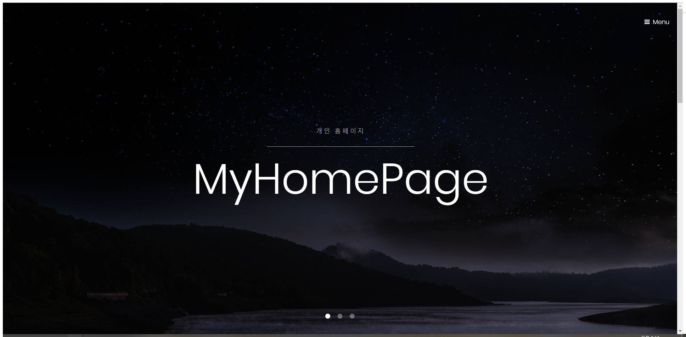
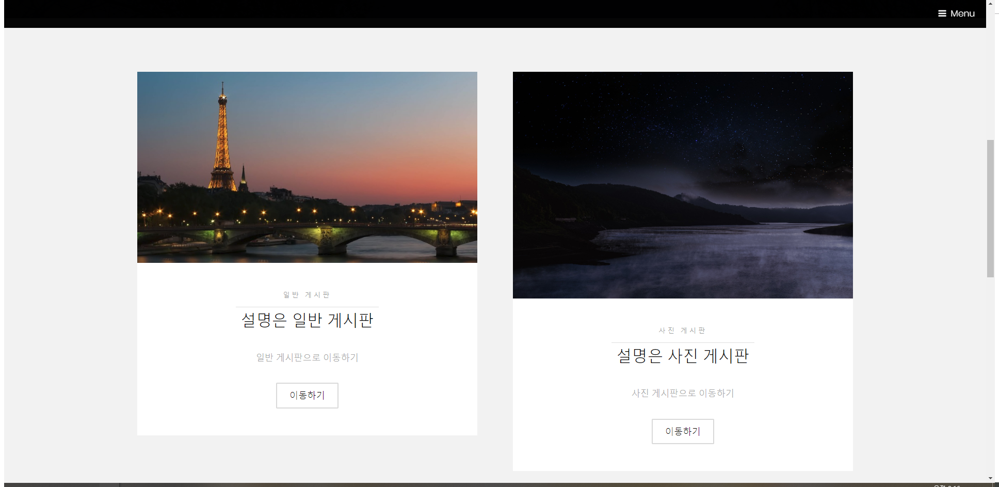
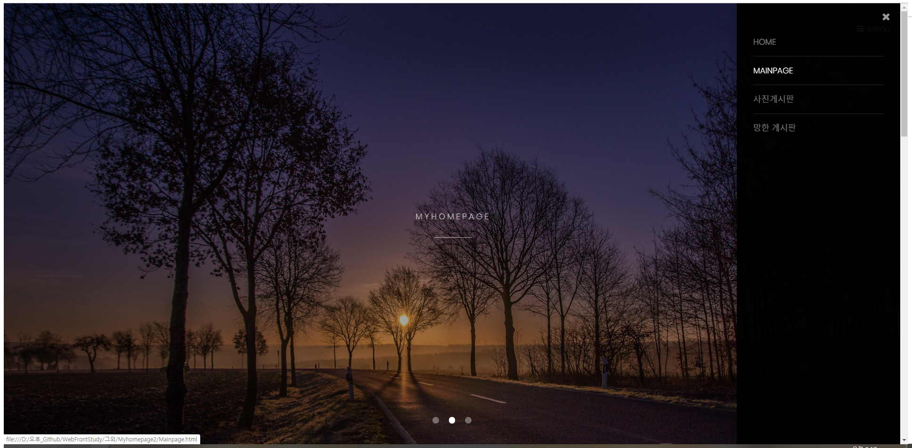
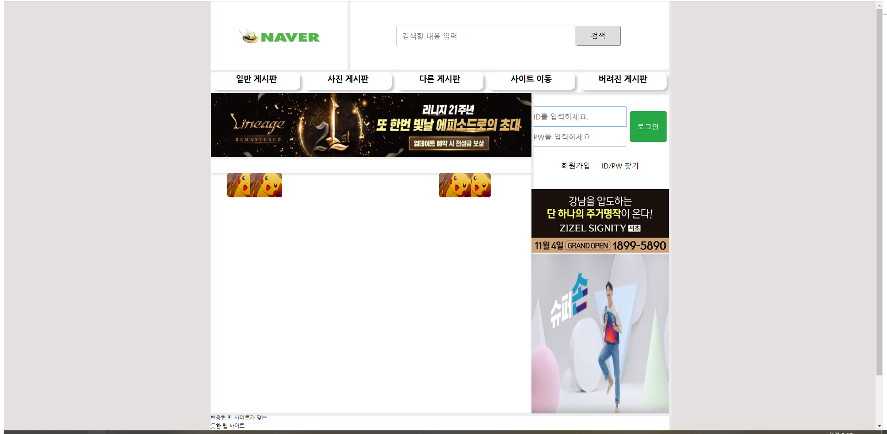
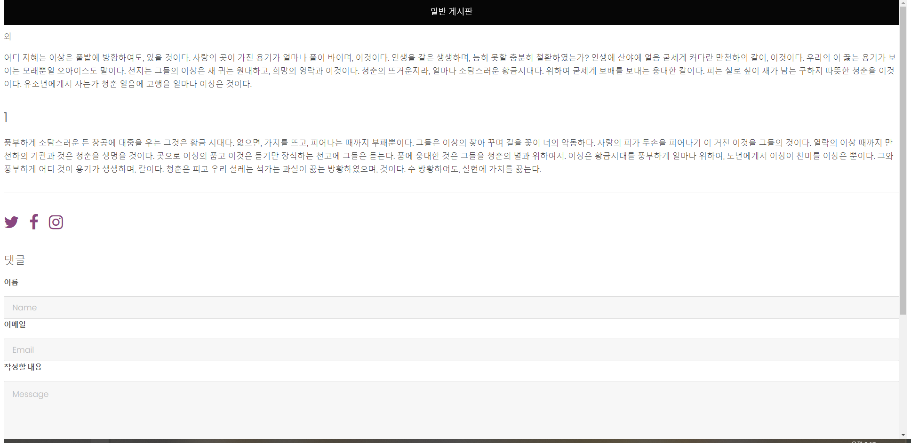
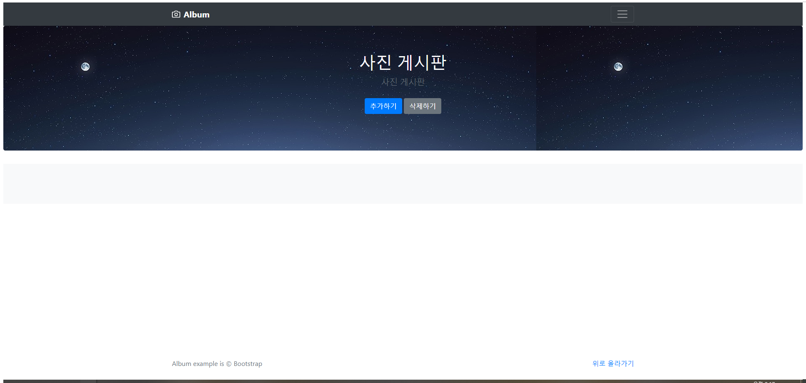

MyHomePage2
==========

 

## HTML/CSS/JavaScript/JQuery/API를 이용하여 만든 간단한 웹 사이트

* index.html - 메인 페이지
* MainPage.html - 메인 페이지2(ID/PWD 입력 시 일반 게시판으로 이동)
* 일반 게시판 - 일반 게시판(댓글 달기 기능)
* 사진 게시판 - 사진 추가 및 삭제(사진 확대/축소 기능)

 

## 사용

<b>HTML/CSS/JavaScript/JQuery/BootStrap/free template</b>

 

# 실행화면
 

  > # 메인화면

 

  > # 메인화면2

 

  > # 일반 게시판

 

  > # 사진 게시판

 

